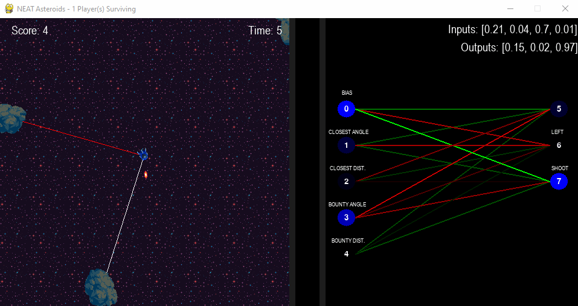

# Preface
This project is my pride and joy, having taken a lot of time, dedication, and effort to complete. It is a from-scratch implementation of the NeuroEvolution of Augmenting Topologies algorithm as detailed in [Kenneth Stanley's original paper](http://nn.cs.utexas.edu/downloads/papers/stanley.ec02.pdf), used to create
neurals network able to effectively play the classic retro game of *Asteroids*. In other words, **the program produces an AI which plays *Asteroids* well, automatically**.

# Algorithm
The details of the theory behind the algorithm can be found in the research paper linked above. To give a high-level overview though, NEAT attempts to find a solution to a given
problem through a combination of genetic evolution and neural network topology augmentation.  

The program starts out with a population of (by default) some number of players, all of which contain a *brain* that is, essentially, a fully connected neural network
with no hidden neurons and randomized weights. As the program goes through generations, the players will begin to evolve through mutations (nodes and connections are added to/removed from neural networks, weights are automatically adjusted, activation functions are changed). The best-performing players (due to helpful mutations), determined by a *fitness function*, are selected to reproduce for the next generation. Furthermore, various neural networks are divided into *species* to preserve innovation: new mutations such as the additions of new nodes/connections often perform worse than if said nodes/connections didn't exist *until the weights of the network are properly adjusted*. Dividing the networks into
species based on their topologies (and then only having members of species compete only with other members of the same species) allows unique neural networks to survive and gives them a safety net in which they have some time to adjust their weights. 
In simpler terms, unique solutions are encouraged, while similar solutions are penalized.

The configuration file of the NEAT component of the program is fully customizable, allowing easy changes to mutation rates, population sizes, and other parameters.

# Bounty System
In the early iterations of the algorithm, there were two favoured strategies:
* Total avoidance of asteroids to maximize survival time:

* And sitting in the center of the screen, not moving, and simply shooting nearby asteroids (a so-called *aimbot*)

While both of these strategies proved effective when it came to maximizing the points that the AI would get, they weren't particularly interesting to watch. After some thought, I've decided to implement a *bounty system*. The idea was as such: a player would be assigned a *bounty* asteroid. This asteroid would give the player a large amount of points when destroyed. Furthermore, the player would be awarded a number of points inversely proportional to the distance from the bounty asteroid. I had hoped that this would encourage players
to become true bounty hunters: moving into melee range of their targets before making the shot. On top of this, I have also begun penalizing players who shoot randomly (by factoring in hit/missed shots to the fitness of a player) to encourage players to learn to aim rather than shooting randomly. To further encourage aiming, I've also made it so that players who destroy asteroids which are neither their bounty nor the closest asteroid to them would have their score penalized. Finally, I've introduced a timer to the system whose purpose is to hurry the players along to their bounties and encourage swift actors. The timer is refreshed upon each successful bounty hit. 

# Inputs and Outputs
The inputs to the neural network are as follows:
* Bias (always on)
* Angle to the closest asteroid (0 when aiming directly at it, 1 when facing away from it)
* Distance to closest asteroid (0 when it's far away, 1 when it's close)
* Angle to the bounty asteroid
* Distance to bounty asteroid

The outputs nodes/available actions are:
* Boost (move forward)
* Turn left/right
* Shoot

# Demonstration
The way this section is structured is by algorithm *stages*, to show players from different eras in a chronological order to illustrate the learning process of the AI. 

**A note on the UI:** Please note that on the right side of each GIF is a graphical representation of the neural network currently being observed. Blue circles are nodes, with the numbers inside them showing their *innovation numbers* or IDs. The left-hand nodes are inputs, while the right-hand nodes are outputs. The saturation of nodes goes from dim to bright depending on how active that node is. 

The lines represent connections. Red lines are negative connections; green are positive. Lines' saturations depend on the strength (weight) of the connections they represent, as well as how active their connecting nodes are.

On the left hand side is the game window. The white line represents the nearest asteroid, while the red line the bounty asteroid.

### Stage 0
At the beginning, the AI doesn't really know what to do. Some players wander and crash, others spin and shoot.

### Stage 1
As time passes, useful mutations (at this point, in the form of connection weight adjustments) begin to emerge. The AI begins to try out new tactics, such as moving around and shooting.

### Stage 2
At this point, the AI has some semblance of an idea as to what it is supposed to be doing. It is clear that it's now trying to go for bounty asteroids, and has, to a degree, learned how to aim. It's still not perfect, however, often being hesitant to shoot (due to the penalties associated with missing), wasting precious time.

### Stage 3
The AI keeps improving. It now actively seeks out its bounties, attempts to get into melee range, and shoots more confidently.

### Stage 4
After quite a few generations, the AI can be said to be quite good at the game. The only way the players tend to die at this point is to the timer, which is the reason it exists in the first place (to keep the mutations moving along and prevent the AI from simply playing the game forever).

### Bonus Stage
At some point in my testing I encountered these "killer drones" which move with ruthless efficiency and live with reckless abandon. They were quite entertaining to watch, though their preference for high speed often resulted in them crashing into things.

### Conclusion
I hope everything was clear and enjoyable to read. If you have any questions, I'm always happy to discuss this project in more detail!
